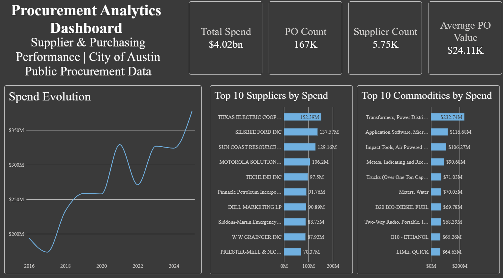
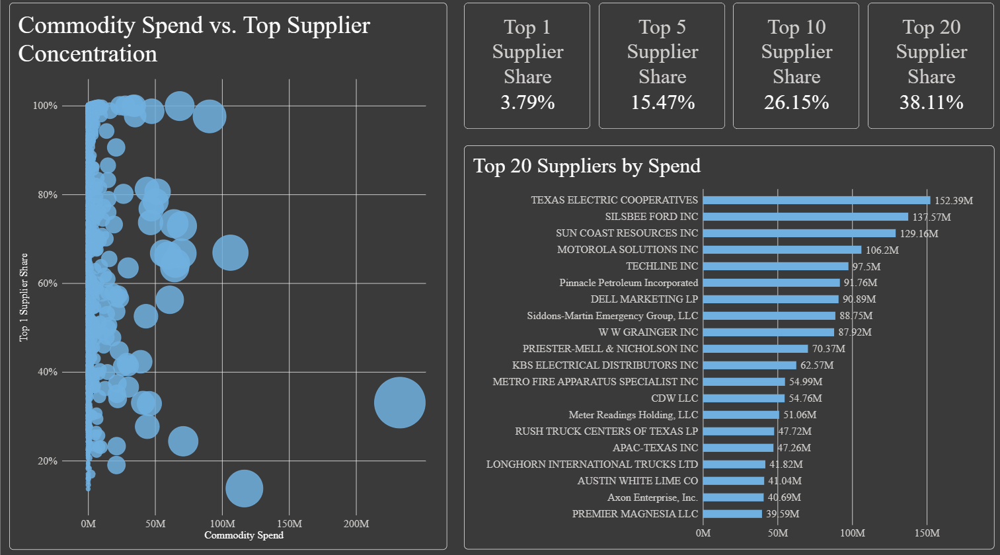
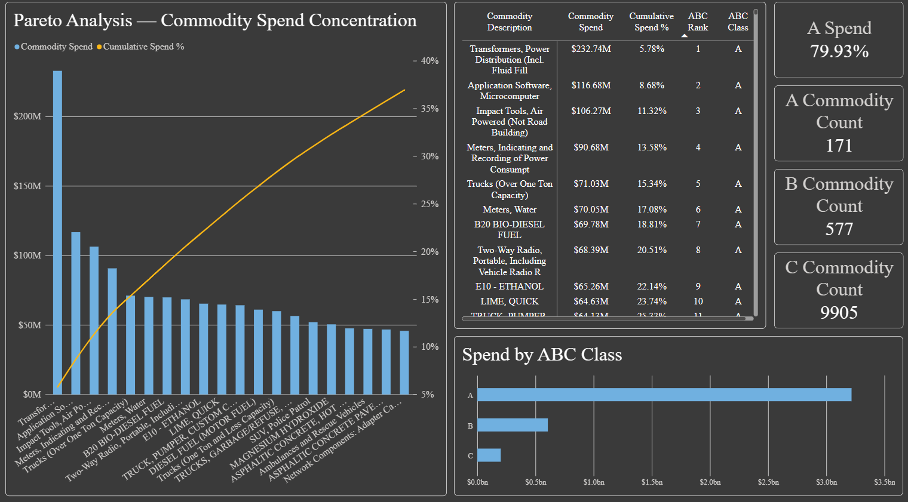

# Procurement Analytics Dashboard — Supplier & Spend Analysis

## Overview

This project is an independent procurement analytics case study built with real public procurement data from the City of Austin Open Data portal.

The objective is to analyze purchasing spend, supplier concentration, commodity-level spend distribution, purchasing activity and data-quality limitations through an interactive Power BI dashboard.

The project was developed as a portfolio project focused on **Procurement, Supply Chain and BI/Analytics** applications. It does not represent employment or professional experience with the City of Austin.

---

## Business Problem

Procurement teams need visibility into how purchasing spend is distributed across suppliers and commodities in order to identify areas that may require deeper analysis and prioritization.

This project addresses three main questions:

### Supplier Management

**How concentrated is procurement spend across suppliers?**

The analysis examines supplier spend shares and concentration at both the overall procurement level and within individual commodities.

### Spend Management

**Which commodities account for the largest share of procurement spend?**

Commodity-level analysis identifies the categories with the highest financial impact and supports spend prioritization.

### Analytical Prioritization

**Where should procurement analysts focus their attention based on spend concentration?**

ABC analysis is used to classify commodities according to their cumulative contribution to total spend.

---

## What I Built

The project covers the complete analytical workflow from raw procurement data to business insights:

* designed a dimensional procurement data model using a Star Schema;
* cleaned and structured the source data in Power Query;
* developed DAX measures for procurement and supplier analysis;
* analyzed supplier spend and concentration;
* analyzed commodity-level spend distribution;
* implemented an ABC spend classification;
* investigated data-quality limitations affecting Quantity;
* built an interactive Power BI dashboard;
* translated analytical results into procurement-oriented insights;
* documented the methodology, model and limitations.

---

## Dataset

**Source:** City of Austin Open Data — *Purchase Order Quantity & Price Detail for Commodity/Goods Procurements*

The dataset contains public procurement transaction records including purchase orders, commodities, suppliers, quantities and prices.

The analysis uses the dataset as an independent public-data case study.

### Analytical Grain

The fundamental grain of the dataset used in this project is:

> **One purchase order × one commodity line**

Because a purchase order may contain multiple lines, purchase order counts are calculated using distinct purchase order identifiers rather than simply counting rows.

---

## Project Scope

### Included

* Total procurement spend
* Purchase order volume
* Supplier count
* Average purchase order value
* Spend evolution over time
* Supplier spend concentration
* Supplier ranking
* Commodity spend ranking
* Commodity spend share
* Supplier concentration within commodities
* ABC commodity classification
* Purchase-line structure
* Quantity data-quality analysis

### Not Included

The dataset does not provide sufficiently reliable information to calculate several operational procurement performance indicators.

Therefore, this project does **not** claim to measure:

* On-Time In-Full (OTIF)
* Supplier delivery performance
* Lead time
* Procurement savings
* Negotiated savings
* Supplier quality performance
* Supplier risk
* Purchase order cycle time

These limitations are treated as part of the analytical findings rather than being replaced with synthetic assumptions.

---

## Data Model

The Power BI model follows a Star Schema:

```text
                    DimVendor
                        |
                        |
DimDate -------- FactPurchase -------- DimCommodity
```

### Fact Table

**FactPurchase**

Contains procurement transaction lines at the Purchase Order × Commodity Line grain.

### Dimension Tables

* **DimVendor** — supplier analysis
* **DimCommodity** — commodity analysis
* **DimDate** — time-based analysis

---

## Key Metrics

Examples of the main measures developed in DAX include:

```DAX
Total Spend = SUM(FactPurchase[Spend])

PO Count =
DISTINCTCOUNT(FactPurchase[PurchaseOrder])

Supplier Count =
DISTINCTCOUNT(FactPurchase[VendorCode])

Average PO Value =
DIVIDE([Total Spend], [PO Count])
```

Additional measures were developed for:

* supplier spend share;
* supplier ranking;
* commodity ranking;
* commodity spend share;
* supplier concentration within commodities;
* average lines per purchase order;
* average spend per line;
* zero-quantity lines;
* spend associated with zero quantity;
* spend associated with positive quantity;
* ABC cumulative spend.

---

## Dashboard

The dashboard consists of three analytical pages.

### 1. Executive Overview

Provides a high-level view of procurement activity, including:

* Total Spend
* Purchase Order Count
* Supplier Count
* Average Purchase Order Value
* Spend evolution over time
* Top suppliers by spend
* Top commodities by spend



---

### 2. Supplier & Concentration

Focuses on supplier spend distribution and concentration.

Key analyses include:

* Top suppliers by spend
* Supplier share of total spend
* Overall supplier concentration
* Supplier concentration within commodities



---

### 3. ABC Analysis

Classifies commodities according to cumulative spend contribution.

The page includes:

* Pareto analysis
* Top commodities by spend
* ABC classification
* Commodity-level analytical detail



---

## Key Findings

### 1. Spend is highly concentrated across commodities

The dataset contains **10,653 commodities**.

Only **171 commodities**, approximately **1.61%** of the commodity portfolio, account for approximately **80% of total spend**.

This indicates that a relatively small portion of the commodity portfolio represents the majority of financial exposure and may therefore warrant greater analytical attention.

---

### 2. Supplier concentration is distributed across a broad supplier base

Supplier concentration at the overall procurement level was measured as follows:

| Supplier Group      | Share of Total Spend |
| ------------------- | -------------------: |
| Top 1               |                3.79% |
| Top 5               |               15.47% |
| Top 10              |               26.15% |
| Top 20              |               38.11% |
| Remaining Suppliers |               61.89% |

Supplier concentration also varies considerably between individual commodities.

Importantly, **supplier concentration alone does not establish supplier risk**. Additional information such as supplier criticality, alternatives, substitutability and capacity would be required for a formal supplier-risk assessment.

---

### 3. Purchasing activity consists of a large number of relatively small transaction structures

The dataset contains approximately:

* **166,919 purchase orders**
* **319,186 purchase lines**

This corresponds to approximately **1.91 purchase lines per purchase order**.

Average spend per purchase line is approximately **$12,609**.

---

### 4. Quantity requires careful interpretation

The analysis identified:

* **107,635 purchase lines** with recorded Quantity = 0;
* approximately **$1.948B** of spend associated with zero-quantity lines;
* approximately **$2.076B** of spend associated with positive-quantity lines.

This means that a substantial portion of total spend is associated with lines where Quantity is recorded as zero.

As a result, **Spend is treated as the primary financial measure**, while Quantity is treated as a supplementary field that requires caution when interpreted as a volume indicator.

---

## Spend Evolution

Annual procurement spend observed in the dataset:

| Year | Spend |
| ---- | ----: |
| 2016 | $193M |
| 2017 | $173M |
| 2018 | $233M |
| 2019 | $258M |
| 2020 | $257M |
| 2021 | $329M |
| 2022 | $271M |
| 2023 | $326M |
| 2024 | $323M |
| 2025 | $377M |

Annual comparisons should be interpreted in the context of the date coverage available in the source dataset. In particular, the completeness of the latest period should be verified before treating it as directly comparable with full historical years.

---

## Methodology

The project followed a structured analytical workflow:

1. Define the procurement business questions.
2. Obtain the public procurement dataset.
3. Clean and transform the data using Power Query.
4. Establish a Star Schema.
5. Create DAX measures.
6. Analyze procurement spend and purchasing activity.
7. Analyze supplier concentration.
8. Perform commodity-level ABC analysis.
9. Investigate data-quality limitations.
10. Build the Power BI dashboard.
11. Translate findings into procurement-oriented insights.
12. Document the methodology and limitations.

---

## Data Quality & Limitations

Several limitations were identified during the analysis.

### Quantity

A significant amount of spend is associated with records where Quantity is zero.

Therefore, Quantity should not be treated as a universally reliable measure of procurement volume.

### Procurement Performance

The dataset does not contain sufficiently reliable fields to calculate operational metrics such as OTIF, lead time or supplier quality.

### Savings

There is no reliable baseline-versus-actual price structure that would support a defensible calculation of procurement savings.

### Supplier Risk

Supplier concentration can identify areas for further investigation, but concentration alone is not equivalent to supplier risk.

### Public Dataset Context

The dataset represents historical public procurement transactions. The analysis should therefore be interpreted as a procurement analytics case study rather than as an assessment of current City of Austin procurement performance.

---

## Tools & Technologies

* **Power BI**
* **Power Query**
* **DAX**
* **Star Schema / Dimensional Modeling**
* **Data Quality Analysis**
* **Procurement Analytics**
* **ABC / Pareto Analysis**

---

## Project Structure

```text
procurement-analytics-dashboard/
├── README.md
├── screenshots/
│   ├── executive-overview.png
│   ├── supplier-concentration.png
│   └── abc-analysis.png
└── documentation/
    └── data-dictionary.md
```

---

## Future Improvements

Potential extensions could include:

* additional supplier segmentation;
* commodity-level supplier dependency analysis;
* price-variation analysis where the source data supports it;
* more detailed temporal analysis;
* additional procurement KPIs if suitable source data becomes available;
* integration with other public procurement datasets.

Any future extension should preserve the same principle of using metrics that are supported by the underlying data rather than introducing unsupported assumptions.

---

## Project Purpose

This project was developed as a portfolio case study to demonstrate practical skills in:

* Procurement Analytics
* Supply Chain Analytics
* Business Intelligence
* Data Modeling
* Power BI
* DAX
* Data Quality Analysis
* Analytical Storytelling

The focus is not only on building a dashboard, but on transforming real-world procurement data into structured analysis while explicitly identifying the limitations and assumptions that affect interpretation.
3. Identify high-spend commodities.
4. Prioritize commodities using ABC analysis.
5. Investigate supplier concentration within individual commodities.
6. Identify relevant data-quality limitations.
7. Distinguish between what the data supports and what it does not support.

This is an **analytical case study based on public data**, not an analysis performed as an employee or representative of the City of Austin.

---

## Dataset

The project uses the City of Austin Open Data dataset:

**Purchase Order Quantity & Price Detail for Commodity/Goods Procurements**

The dataset contains purchase-order and commodity-level procurement records.

### Analytical grain

The primary fact table operates at:

> **Purchase Order × Commodity Line**

This grain allows supplier, commodity, purchasing and spend analysis without reducing every purchase order to a single observation.

### Main fields used

The analysis uses fields including:

* Purchase Order
* Vendor Code
* Vendor Name
* Spend
* Quantity
* Unit Price
* Award Date
* Commodity
* Commodity Description
* Extended Description
* Vendor City
* Vendor State
* Vendor ZIP
* Vendor Country

---

## Project Scope

The project focuses on metrics that can be calculated defensibly from the available data.

### Included

* Total Spend
* Purchase Order Count
* Purchase Line Count
* Supplier Count
* Average PO Value
* Average Line Spend
* Average Unit Price
* Total Quantity
* Spend evolution over time
* Supplier spend ranking
* Supplier concentration
* Commodity spend ranking
* Commodity concentration
* ABC commodity classification
* Pareto analysis
* Quantity-related data-quality analysis

### Deliberately excluded

The dataset does not provide sufficient information to calculate several common procurement-performance KPIs reliably.

Therefore, the project does **not** fabricate or infer:

* OTIF
* Lead Time
* Procurement Savings
* Cost Avoidance
* Supplier Quality Score
* Supplier Risk Score
* Procurement Efficiency Score

These metrics would require additional operational, contractual or supplier-performance data.

---

## Data Model

The Power BI model follows a dimensional **Star Schema**.

```text
                    ┌───────────────┐
                    │   DimDate     │
                    └───────┬───────┘
                            │
                            │
┌───────────────┐     ┌─────▼─────────┐     ┌─────────────────┐
│   DimVendor   │────▶│ FactPurchase  │◀────│ DimCommodity    │
└───────────────┘     └────────────────┘     └─────────────────┘
```

### Fact table

**FactPurchase**

Contains the transaction-level procurement records.

### Dimension tables

**DimVendor**

* Supplier attributes

**DimCommodity**

* Commodity attributes

**DimDate**

* Date attributes used for time-based analysis

### Relationships

* DimVendor (1) → FactPurchase (*)
* DimCommodity (1) → FactPurchase (*)
* DimDate (1) → FactPurchase (*)

The dimensional model separates transactional data from descriptive dimensions and supports reusable DAX measures across the report.

---

## Key Metrics

The dashboard includes measures such as:

### Spend

```DAX
Total Spend =
SUM(FactPurchase[Spend])
```

### Purchase Orders

```DAX
PO Count =
DISTINCTCOUNT(FactPurchase[PurchaseOrder])
```

### Suppliers

```DAX
Supplier Count =
DISTINCTCOUNT(FactPurchase[VendorCode])
```

### Average PO Value

```DAX
Average PO Value =
DIVIDE([Total Spend], [PO Count])
```

### Supplier Share

```DAX
Supplier Share % =
DIVIDE(
    [Total Spend],
    CALCULATE([Total Spend], ALL(DimVendor))
)
```

### Spend YoY

```DAX
Spend YoY % =
DIVIDE(
    [Total Spend] - [Previous Year Spend],
    [Previous Year Spend]
)
```

Additional measures support supplier ranking, commodity ranking, supplier concentration, ABC analysis and data-quality analysis.

---

## Dashboard

The report contains three analytical pages.

### 1. Executive Overview


The Executive Overview provides a high-level view of procurement activity.

It includes:

* Total Spend
* PO Count
* Supplier Count
* Average PO Value
* Spend Evolution
* Top 10 Suppliers by Spend
* Top 10 Commodities by Spend

The page answers:

> **How much are we spending, and where is the spend concentrated at a high level?**

---

### 2. Supplier & Concentration


This page focuses on supplier concentration and the relationship between commodity spend and supplier concentration.

It includes:

* Top 1 Supplier Share
* Top 5 Supplier Share
* Top 10 Supplier Share
* Top 20 Supplier Share
* Top 20 Suppliers by Spend
* Commodity Spend vs. Top Supplier Concentration

The page answers:

> **Where is supplier spend concentrated, and how does supplier concentration vary across commodities?**

---

### 3. ABC Analysis


The ABC Analysis page applies a spend-based ABC classification to commodities.

Classification:

* **Class A:** cumulative spend up to approximately 80%
* **Class B:** cumulative spend from approximately 80% to 95%
* **Class C:** remaining commodities

The page includes:

* A Spend %
* A Commodity Count
* B Commodity Count
* C Commodity Count
* Pareto Analysis
* Top 10 Commodities
* ABC Detail Table

The page answers:

> **Which commodities account for most of the spend and should receive greater analytical attention?**

---

## Key Findings

### 1. Spend is highly concentrated across commodities

The dataset contains **10,653 distinct commodities**.

Only **171 commodities**, representing approximately **1.61%** of all commodities, account for approximately **80% of total spend**.

The ABC distribution is:

| Class | Commodities | Share of Commodities | Share of Spend |
| ----- | ----------: | -------------------: | -------------: |
| A     |         171 |                1.61% |           ~80% |
| B     |         577 |                5.42% |           ~15% |
| C     |       9,905 |               92.97% |            ~5% |

**Procurement implication:** Class A commodities can be prioritized for deeper sourcing, supplier and spend analysis.

**Limitation:** ABC classification is based on spend only. It does not measure operational criticality, supply risk, substitutability or strategic importance.

---

### 2. Overall supplier spend is distributed across a broad supplier base

Supplier concentration at the overall level is:

| Supplier Group      | Share of Spend |
| ------------------- | -------------: |
| Top 1               |          3.79% |
| Top 5               |         15.47% |
| Top 10              |         26.15% |
| Top 20              |         38.11% |
| Remaining Suppliers |         61.89% |

The largest individual supplier therefore represents less than 4% of total spend.

**Procurement implication:** supplier concentration should be evaluated beyond the single largest supplier, with the Top 20 providing a useful starting point for deeper analysis.

**Limitation:** spend concentration alone does not establish supplier risk. Additional information about criticality, alternatives, capacity and substitutability would be required.

---

### 3. Supplier concentration varies significantly by commodity

The commodity-level concentration analysis shows that the supplier structure can differ substantially between categories.

Examples observed in the analysis include:

* Power Consumption Meters — approximately 98% top-supplier share
* Water Meters — approximately 73%
* Impact Tools — approximately 67%
* B20 Bio-Diesel — approximately 67%
* Transformers, Power Distribution — approximately 33%
* Two-Way Radio — 100%

**Procurement implication:** high-spend commodities with highly concentrated supplier bases may warrant further investigation into supplier dependency and sourcing alternatives.

**Limitation:** the analysis identifies concentration, not supplier risk. A concentrated category is not automatically a high-risk category.

---

### 4. Transaction-level analysis provides greater procurement granularity

The dataset contains approximately:

* **166,919 purchase orders**
* **319,186 purchase lines**
* **1.91 lines per purchase order**
* **$12,609 average spend per line**

Analyzing the data at the purchase-order × commodity-line level allows supplier and commodity spend to be examined with greater granularity than a simple purchase-order-level analysis.

---

### 5. Quantity has significant data-quality limitations

The dataset contains:

* **107,635 lines with Quantity = 0**
* Approximately **$1.948B** of spend associated with zero-quantity lines
* Approximately **$2.076B** of spend associated with positive-quantity lines

Therefore, approximately **48.4% of total spend** is associated with lines where Quantity equals zero.

**Implication:** Quantity cannot be treated as a universal proxy for physical purchasing volume in this dataset.

For this reason, **Spend is retained as the primary financial measure**, and unsupported calculations such as universally reconstructing spend from `Quantity × Unit Price` are avoided.

**Limitation:** the dataset alone does not establish why these records have zero quantity, so they should not automatically be classified as errors.

---

## Spend Evolution

The annual spend values represented in the dashboard are:

| Year |  Spend |
| ---- | -----: |
| 2016 | ~$193M |
| 2017 | ~$173M |
| 2018 | ~$233M |
| 2019 | ~$258M |
| 2020 | ~$257M |
| 2021 | ~$329M |
| 2022 | ~$271M |
| 2023 | ~$326M |
| 2024 | ~$323M |
| 2025 | ~$377M |

The series shows substantial variation across years, including increases in 2018, 2021 and 2023, followed by a higher reported value in 2025.

Year-over-year interpretation should take into account the underlying date coverage of the source data, particularly when comparing periods that may not have equivalent completeness.

---

## Methodology

The project follows the general workflow:

```text
Raw Public Data
       ↓
Data Preparation
       ↓
Power Query Transformation
       ↓
Dimensional Data Model
       ↓
DAX Measures
       ↓
Procurement Analysis
       ↓
Power BI Dashboard
       ↓
Business Insights
```

### Data preparation

Power Query was used to prepare and structure the source data before loading it into the analytical model.

### Data modeling

The model was organized into a Star Schema with:

* one central fact table;
* supplier dimension;
* commodity dimension;
* date dimension.

### DAX

DAX measures were created for:

* spend;
* purchase orders;
* suppliers;
* averages;
* rankings;
* shares;
* year-over-year analysis;
* concentration;
* ABC analysis;
* data-quality analysis.

### ABC methodology

Commodities are ranked by spend and assigned to A, B or C according to cumulative spend:

```text
A → up to ~80%
B → ~80% to ~95%
C → remaining ~5%
```

The classification is deterministic and uses commodity description as a tie-breaker when required.

---

## Data Quality & Limitations

A key principle of this project is to distinguish between **what the data can demonstrate and what it cannot**.

The dataset supports spend, supplier, commodity and transaction analysis, but it does not contain all information required for a complete procurement-performance assessment.

Important limitations include:

### Quantity

A significant amount of spend is associated with zero-quantity lines. Quantity is therefore not treated as a universally reliable volume measure.

### Supplier risk

Supplier concentration is measurable, but supplier risk is not directly measurable from the available fields.

### Lead time

The dataset does not provide reliable order-to-delivery timestamps required to calculate lead time.

### OTIF

On-time-in-full performance requires promised dates, actual delivery dates and complete quantity fulfillment information, which are not available at the required level.

### Savings

Savings or cost avoidance cannot be calculated without a reliable baseline, negotiated price information or comparable sourcing scenario.

### Supplier quality

There is insufficient information to calculate supplier defect, rejection or quality-performance metrics.

These limitations are documented rather than replaced with assumptions or synthetic metrics.

---

## Tools & Technologies

* **Microsoft Power BI**
* **Power Query**
* **DAX**
* **Dimensional / Star Schema Modeling**
* **Data Quality Analysis**
* **ABC / Pareto Analysis**
* **Procurement & Spend Analytics**

---

## Project Structure

The repository is organized around the final analytical deliverable.

```text
procurement-analytics-dashboard/
│
├── README.md
│
├── dashboard/
│   └── Procurement_Analytics_Dashboard.pbix
│
├── screenshots/
│   ├── executive-overview.png
│   ├── supplier-concentration.png
│   └── abc-analysis.png
│
└── documentation/
    └── data-dictionary.md
```

The repository structure may evolve as supporting documentation and dashboard assets are added.

---

## Future Improvements

If additional procurement data were available, the analytical model could be extended with:

* supplier lead-time analysis;
* OTIF performance;
* contract compliance;
* price variance analysis;
* purchase price variance;
* supplier quality;
* supplier risk indicators;
* sourcing alternatives;
* category-level benchmarking;
* procurement savings and cost avoidance.

These extensions would require additional source data rather than assumptions derived from the current dataset.

---

## Project Purpose

This project was developed as a portfolio case study to demonstrate practical application of **Business Intelligence and Procurement Analytics** concepts using real-world public data.

The emphasis is not only on building visualizations, but on:

* structuring transactional data;
* designing an analytical model;
* developing reusable DAX measures;
* identifying meaningful procurement patterns;
* assessing data quality;
* communicating business implications;
* and clearly documenting analytical limitations.

The result is intended to demonstrate an analytical approach applicable to **Procurement, Supply Chain, Business Intelligence, Data Analytics and Process Improvement** environments.
